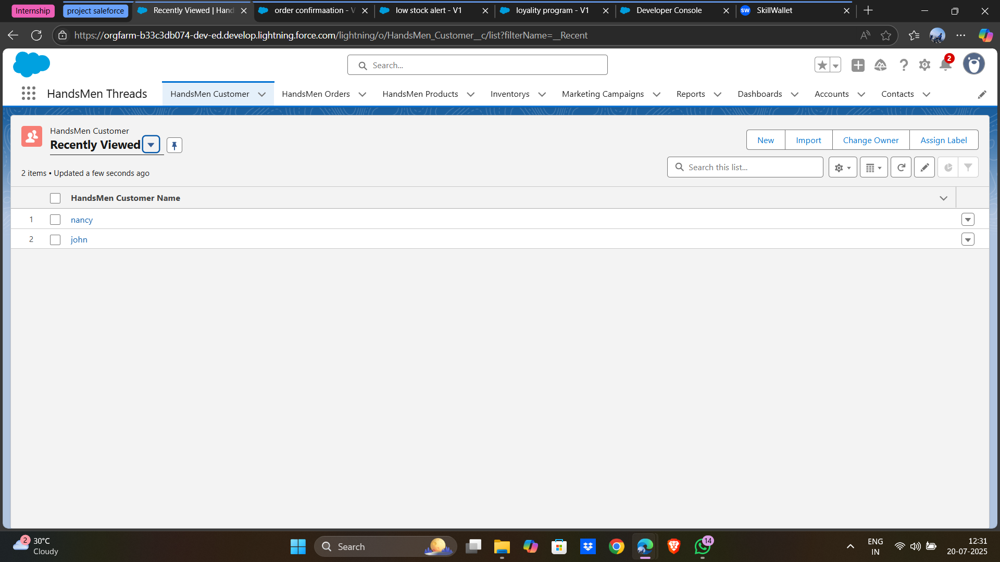
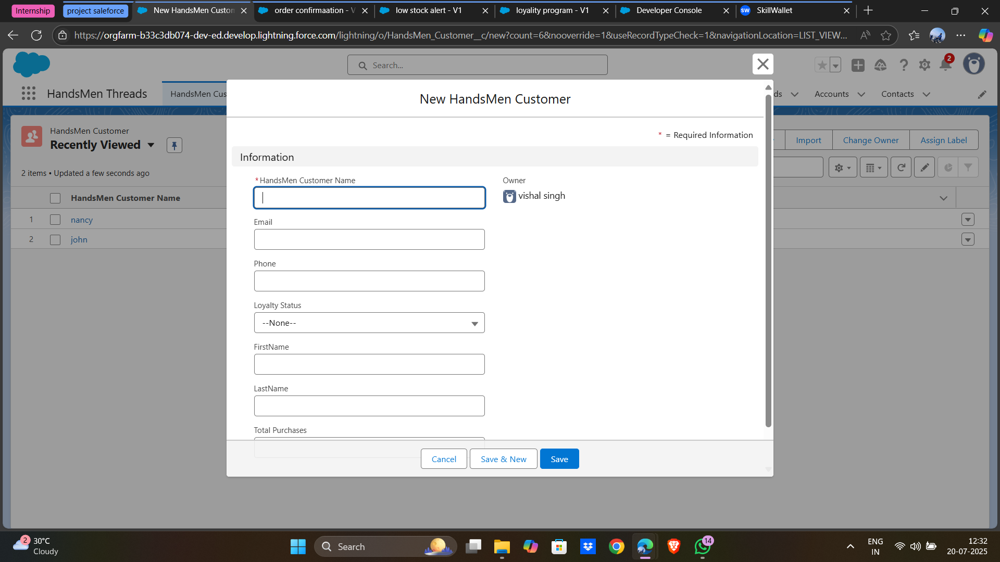
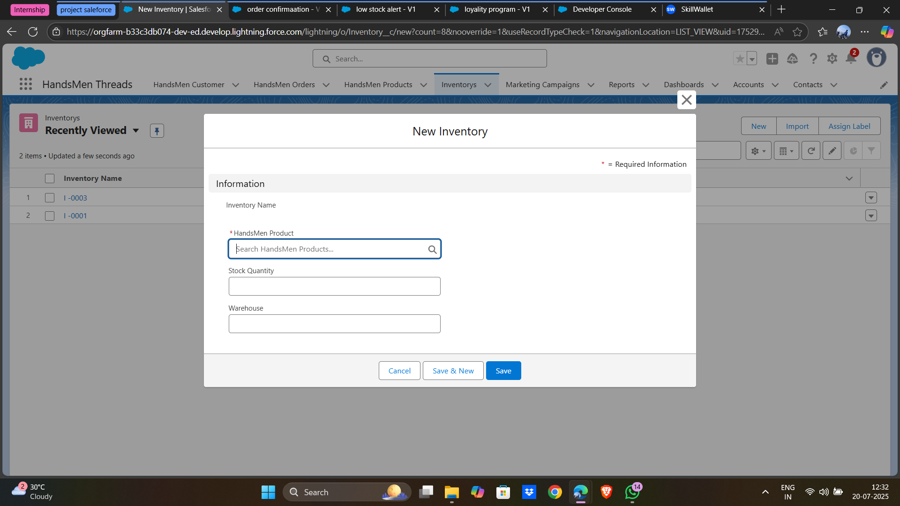
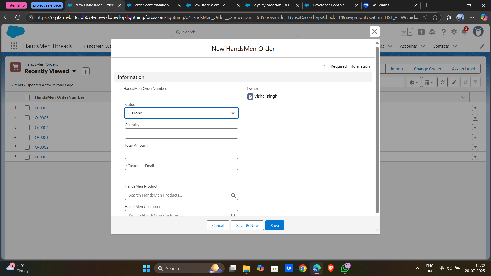
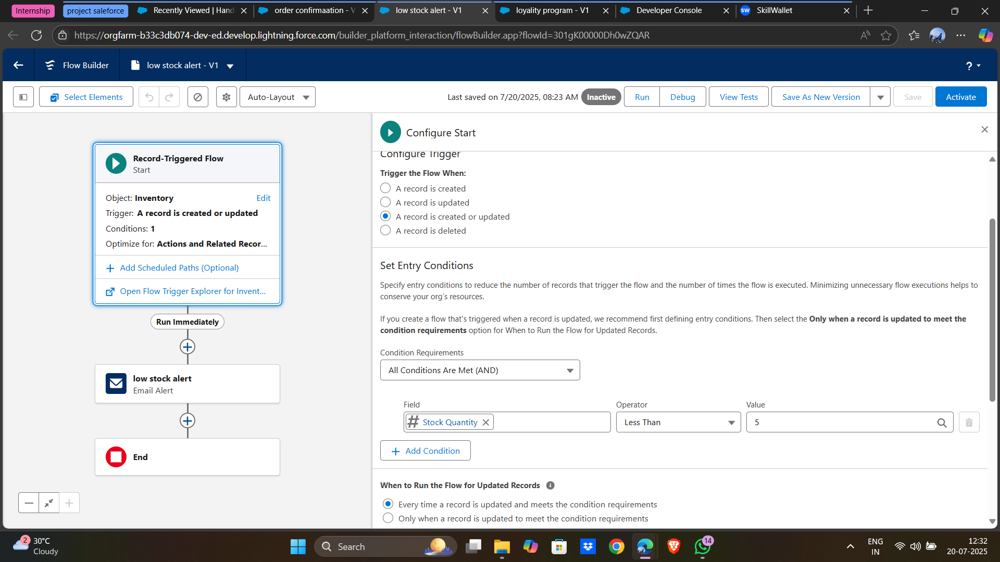
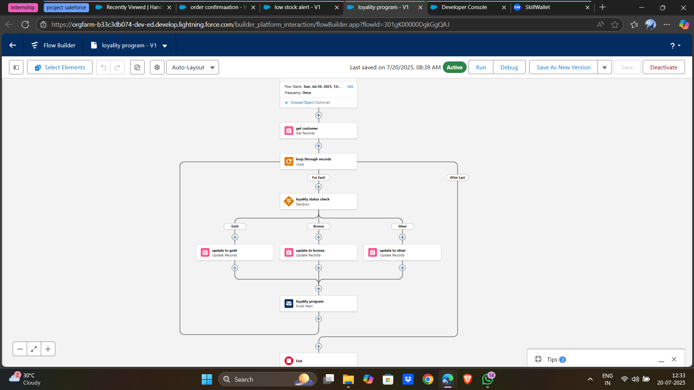
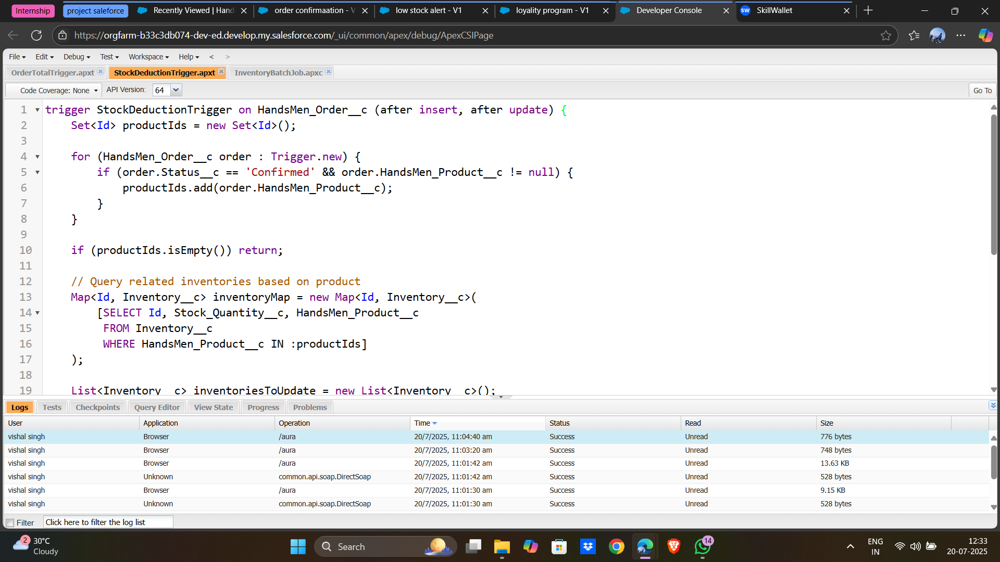
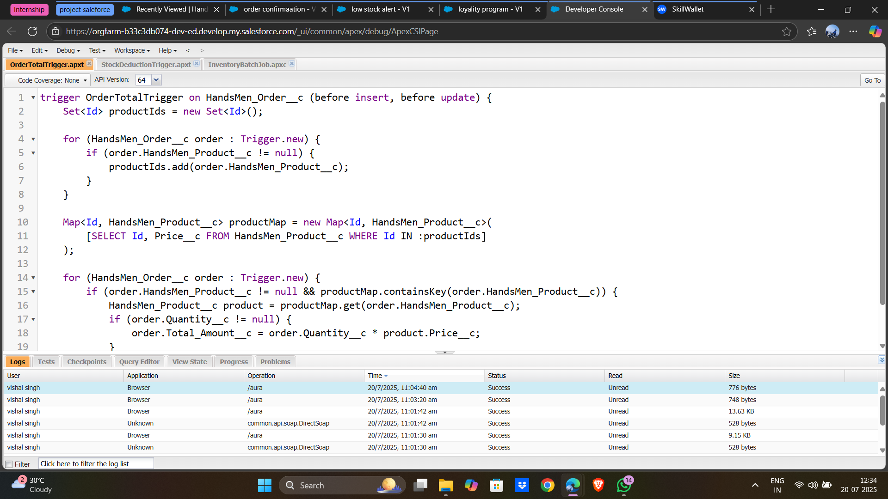

# 👔 HandsMen Threads: Elevating the Art of Sophistication in Men's Fashion

## 📌 Project Overview

**HandsMen Threads** is a Salesforce-based custom solution tailored for managing an online men’s fashion retail business. The system handles customer orders, tracks inventory, sends dynamic email alerts, and manages customer loyalty—all in a seamless automated flow using Salesforce tools.

---

## 🧱 Project Phases

### Phase 1: Architecture & Planning
- Defined custom objects: `HandsMen_Customer__c`, `HandsMen_Product__c`, `HandsMen_Order__c`, `Inventory__c`
- Created fields, relationships, and formula fields.
- Established validation rules, flows, Apex triggers, and batch jobs.
- Designed email templates for order confirmation, low stock alerts, and loyalty status updates.

### Phase 2: Development
- Implemented object and field creation.
- Set up automation: flows, process builders, Apex triggers.
- Established security/sharing rules.
- Developed batch jobs for order processing.
- Configured email templates.

### Phase 3: Testing & QA
- Unit testing of objects and automation.
- End-to-end testing with sample records.
- Performance testing and security checks.

### Phase 4: Deployment & Training
- Deployed to production environment.
- Conducted user training.
- Provided post-go-live support.

---

## 🧩 Key Components

### 📂 Apex Triggers
- **OrderTotalTrigger**: Automatically calculates total price = quantity × product price.
- **StockDeductionTrigger**: Deducts stock quantity once the order is confirmed.

### 📂 Email Templates
- **Order Confirmation**
- **Low Stock Alert**
- **Loyalty Status Notification**

### 🧪 Automation
- Flow-based updates to manage status, loyalty status, and email delivery.

---

## 🖼️ Screenshots

### 🎯 Custom Objects & Fields

### 🔄 Flow & Automation

### 📧 Email Template - Order Confirmation

### 🔢 Trigger for Order Total

### 📉 Trigger for Stock Deduction

### 👥 Record Details & Testing

### 📊 Reporting & Dashboards

---

## 📥 How to Use / Deploy

1. Clone or download the repository.
2. Upload Apex triggers under `triggers/` to your org.
3. Create the corresponding custom objects and fields.
4. Import and assign email templates from `email-templates/`.
5. Add automation flows and test using sample data.
6. Place screenshots under the `images/` folder for documentation.

---

## 🏁 Conclusion

This project shows how Salesforce can be effectively used for custom business solutions beyond CRM—streamlining e-commerce operations like order tracking, inventory updates, and customer communication.

---

## 🙋‍♂️ Developed by
**Vishal Singh**
Salesforce Virtual Internship Program, 2025
